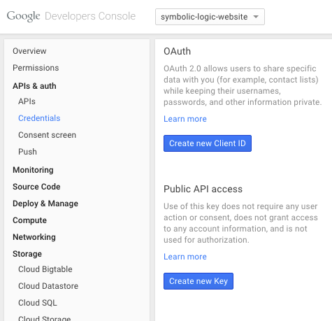
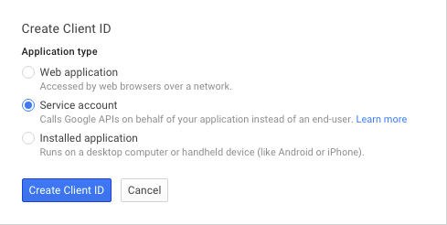
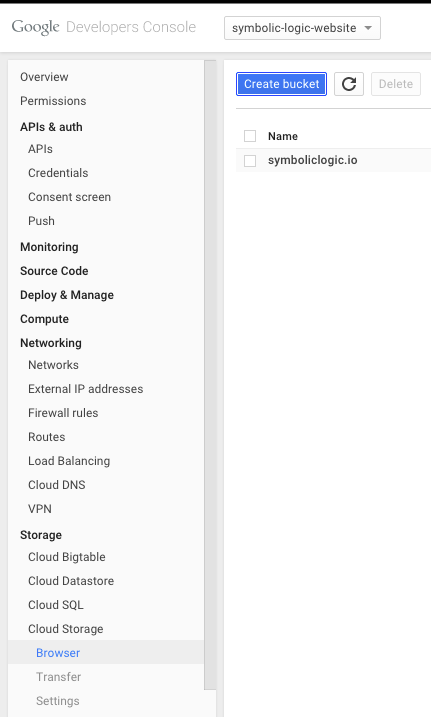
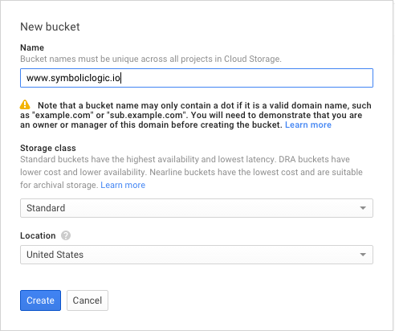
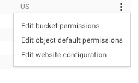
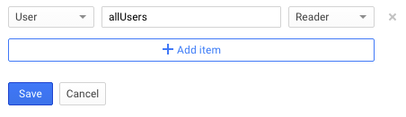
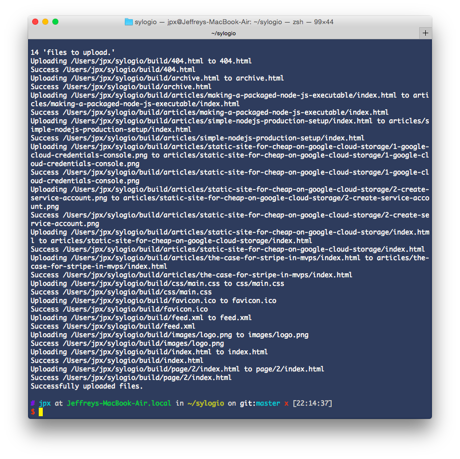

Google Cloud Storage is **durable file hosting** (CDN) with
advanced permissions. We'll review how to setup a static
website with a custom domain name, and deploy the files using a bash script.

## Cost

Google Cloud Storage is at least as cheap as Amazon Cloud Storage.

In most cases, it will only cost *a few cents per month*.

## But...HTTPS is not supported

For custom domains, you cannot (yet) use an SSL certificate for HTTPS.

HTTPS is available though when using `https://storage.googleapis.com/YOUR-SITE-NAME-HERE/`.
That is best for backend files, not a public website.

## Prerequesites

- [Node.js and NPM](https://nodejs.org/download/)
- have a static website with your HTML, CSS, JavaScript, etc
- have a [Google Cloud Platform project](https://console.developers.google.com/project)


## 1. Google Cloud Credentials

Generate new *service account credentials* by going to
the developer console: https://console.developers.google.com.

Click *Create a new client ID* then select a new *Service Account*.
A JSON file will download. Save it in your project as `gcloud.json`.





## 2. Verify site ownership

Google requires you to verify that you own the site in
[Google Webmaster Tools](https://www.google.com/webmasters/tools/home).
There are several ways to do that. If your website is new, most likely
you'll need to create a `TXT` DNS record with your registrar. Webmaster Tools
will guide you through it.

## 3. Create a special bucket

Files on Google Cloud Storage are grouped into "buckets." A bucket is just a
bunch of files that you want to store together. I think of it like it's
own drive. You can have folders under a bucket.



The **bucket name must be the domain name** of your website. So for
`http://symboliclogic.io`, the bucket name would be `symboliclogic.io`.
For `http://www.symboliclogic.io`, the bucket name would be
`www.symboliclogic.io`.



Be sure to choose **Standard** storage. The other options are for backups and
can take several seconds to be accessible.
**Standard** class storage is fast and suitable for websites.

## 4. Set the default bucket permissions

You want to make all files public by default. Accomplish this by
adding an access rules for `allUsers` which allows reading.





Do this for the *Default bucket permissions*, and the *Default object permissions*.

## 5. DNS record pointing to your site

After verifying ownership of your site, create a new DNS record that points
your domain name to Google Cloud Storage.

It should be a `CNAME` type DNS record with the content `c.storage.googleapis.com`.

## 6. Upload files to the bucket with a Node.js script

First use the tool `npm` (bundled with Node.js) to install some dependencies
into the current directory:

```bash
npm install async gcloud glob
```

Now put the following script at `deploy.js` then run it from the terminal:

```bash
node deploy.js
```

```javascript
// Edit these to match your particular local setup.
var PATH_TO_GCLOUD_JSON = __dirname + '/gcloud.json';
var PATH_TO_STATIC_FILES = __dirname + '/build/**/*';
var GCLOUD_PROJECT_ID = 'mywebsite-project';
var GCLOUD_BUCKET_NAME = 'www.mywebsite.com';

// dependencies
var glob = require('glob')
var async = require('async');
var fs = require('fs');
var gcloud = require('gcloud');

var log = console.log;

var gcs = gcloud.storage({
    keyFilename: PATH_TO_GCLOUD_JSON,
    projectId: GCLOUD_PROJECT_ID
});

var bucket = gcs.bucket(GCLOUD_BUCKET_NAME);

glob(PATH_TO_STATIC_FILES, { nodir: true }, function (err, files) {
    if (err) {
        log(err.message, err.stack);
        return;
    }
    log(files.length, 'files to upload.');
    async.mapSeries(files, function (file, cb) {
        var dest = file.replace(__dirname + '/build/', '');
        var gFile = bucket.file(dest);
        log('Uploading', file, 'to', dest);
        bucket.upload(file, {
            destination: gFile
        }, function (err) {
            if (err) { log('ERROR', file, err.message); }
            else { log('Success', file); }
            cb(err);
        });
    }, function (err) {
        if (err) { log(err.message, err.stack); }
        else { log('Successfully uploaded files.'); }
    });
});
```

You should see the similar output:



## 7. Check your work

Now view your website.

## Notes

Google Cloud Storage is a CDN, so it can take 10+ minutes to populate your
files across the CDN regions.

You might also want to add a `gzip` step to reduce file sizes, and set the
file metadata to have a header:

```
Content-Encoding: gzip
```
